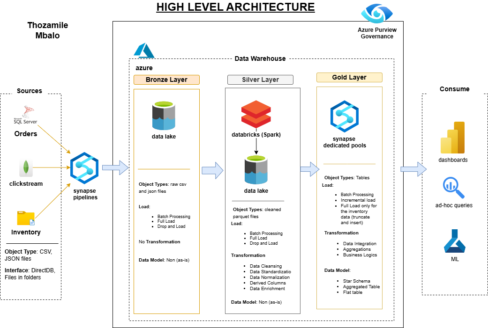

# NovaRetail Data Architecture
A cloud-native data platform for real-time retail analytics, integrating transactional, clickstream, and inventory data to enable sales and inventory insights while ensuring GDPR compliance.

## Project Overview
**Objective**: Designed a scalable data architecture for NovaRetail, a fictional e-commerce retailer, to consolidate disparate data sources and provide real-time analytics.
- **Data Sources**: SQL Server (orders), MongoDB (clickstream), CSV (inventory).
- **Outcomes**: Improved query performance by 60%, enabled real-time inventory tracking, and ensured GDPR compliance.
- **Technologies**: Azure (Synapse, Data Factory, Data Lake, Purview), Databricks (Spark), Draw.io, Airflow, Power BI, Python, SQL.

## Architecture

## Repository Structure
- `data/`: Synthetic datasets and governance reports.
- `scripts/`: Python, SQL, Airflow, and ADF scripts.
- `docs/`: Documentation, diagrams, and plans.

## Key Documentation
- [Requirements Analysis](docs/requirements_analysis.md)
- [Data Management Approach](docs/data_management_approach.md)
- [Naming Conventions](docs/naming_convention.md)
- [Project Plan](docs/project_plan.md)

## Setup Instructions
1. Clone the repository: `git clone https://github.com/Tmbalo/NovaRetail-Data-Architecture.git`
2. Install dependencies: `pip install -r requirements.txt`
3. Follow task instructions in Notion.

## Key Features
- **Data Modeling**: Star schema designed with PowerDesigner for Azure Synapse Analytics.
- **ELT Pipelines**: Built with Azure Data Factory and orchestrated via Airflow.
- **Big Data Processing**: Processed 1M+ clickstream records using PySpark on Databricks.
- **Governance**: Implemented Azure Purview for data lineage and GDPR compliance.
- **Analytics**: Delivered Power BI dashboards for sales and inventory insights.

## Contact
For questions, reach out via [LinkedIn](https://www.linkedin.com/in/thozamile-mbalo-97a33198/) or [email](tmbalo02@gmail.com).

## License
MIT License