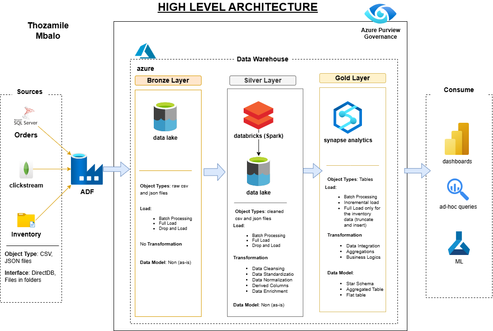

## Data Architecture Design
## Architecture Diagram

### Bronze Layer
- **Purpose**: Store raw transactional, clickstream, and inventory data.
- **Datasets**:
  - `raw_orders`: order_id, customer_id, customer_name, email_pii, phone_pii, product_id, product_name, product_category, unit_price, order_date, total_amount, region.
  - `raw_clickstream`: user_id, session_id, page_views, product_id, product_name, product_category, timestamp, session_duration_seconds.
  - `raw_inventory`: product_id, product_name, product_category, unit_price, warehouse_id, warehouse_name, warehouse_region, employee_count, stock_quantity, update_date.
- **Storage**: Azure Data Lake (CSV/JSON).
- **Validation**: Schema checks, null counts, row counts (~10,000 orders, ~20,000 clickstream, ~5,000 inventory daily).

### Silver Layer
- **Purpose**: Cleanse and transform data for analytics and GDPR compliance.
- **Transformations**:
  - Orders: Deduplicate order_id, standardize order_date, tag email_pii/phone_pii, validate total_amount ≥ 0, enforce product_category (e.g., Sofa in Furniture).
  - Clickstream: Deduplicate session_id, normalize session_duration_seconds, validate page_views ≥ 0, enforce product_category.
  - Inventory: Validate stock_quantity ≥ 0, standardize update_date, enforce product_category.
- **Datasets**: cleaned_orders, cleaned_clickstream, cleaned_inventory.
- **Storage**: Azure Data Lake (Parquet).
- **Tool**: Databricks (PySpark).

### Gold Layer
- **Purpose**: Star schema for real-time analytics.
- **Tables**:
  - Sales_Fact: order_id, customer_id, product_id, warehouse_id, region_id, order_date, total_amount.
  - Customer_Dim: customer_id, customer_name, email_pii, phone_pii, region, is_pii.
  - Product_Dim: product_id, product_name, product_category, unit_price.
  - Warehouse_Dim: warehouse_id, warehouse_name, warehouse_region, employee_count.
  - Region_Dim: region_id, region_name, country.
  - Time_Dim: date, year, quarter, month, day.
- **Storage**: Azure Synapse Analytics.
- **Integration**: Join on product_id, link user_id to customer_id.
